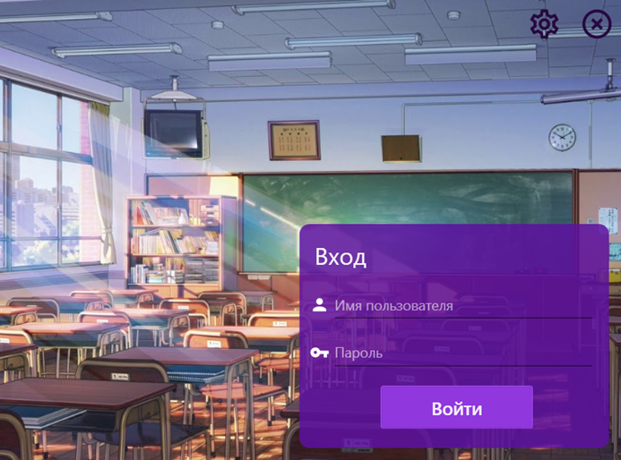

# Coins-Database
### Данная ИС предназначена для ведения учёта профессиональной деятельности сотрудников ОШ, лицеев, гимназий и институтов, с системой поощрения наградами четырёх видов и формированием рейтингов для внутреннего соревнования.
##### Авторизация
​
##### Параметры подключения
​
+ Основной функционал
  + Администратор
    + ###### Окно администратора
    + Администратор может формировать рейтинги, выдавать награды учителям за профессиональную деятельность, вести учёт мероприятий, просматривать участников мероприятий, принимать/отклонять заявки от учителей, менять параметры системы и экспортировать данные в Excel.
    + ​
    + ###### Выдача награды за профессиональную деятельность
    + ​
    + ###### Заявки от учителей на выдачу награды за профессиональную деятельность
    + ​
    + ###### Изменение параметров системы.
    + Администратор может присваивать учителю, находящемуся в БД, логин и пароль для использования программы. Также, он может менять дату системы для просмотра архивов за прошлые семестры. В начале нового семестра (1 сентября и 1 января) семестр меняется на новый автоматически), при этом происходит очистка таблиц с наградами, мероприятиями и заявками. Найти их можно в архиве, сменив дату сисемы.
    + ​
  + Учитель
    + ###### Мои награды
    + Учитель может просматривать свои награды и общий рейтинг, для поднятия сопернического духа и большей мотивации.
    + ​
    + ###### Мои заявки
    + Учитель может просматривать свои заявки и видеть их статус. Новая заявка генерируется автоматически, требуя от учителя лишь указание мероприятия, за которое он хочет получить награду. ПОдпись также ставится автоматически.
    + ​
##### Для инсталляции необходимо восстановить БД по бэкапу из папки "PG Backup" и установить ИС из инсталлятора в папке "Publication".  
###### Используемые технологии: C#, WPF, MVVM, NUnit
###### СУБД: PostgreSQL
